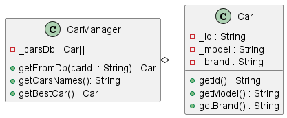
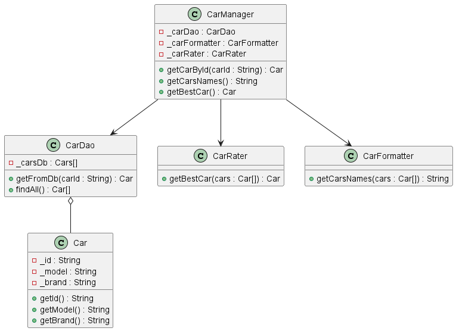
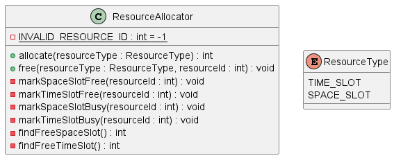
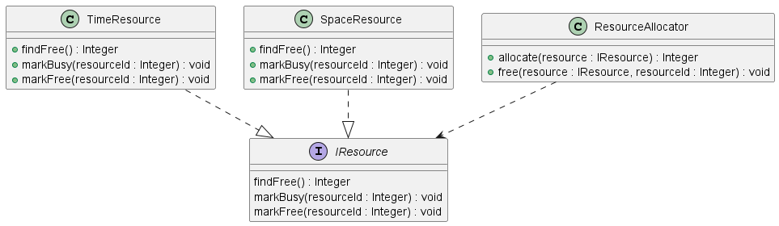
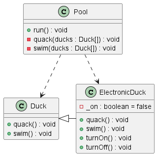
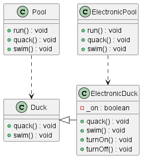
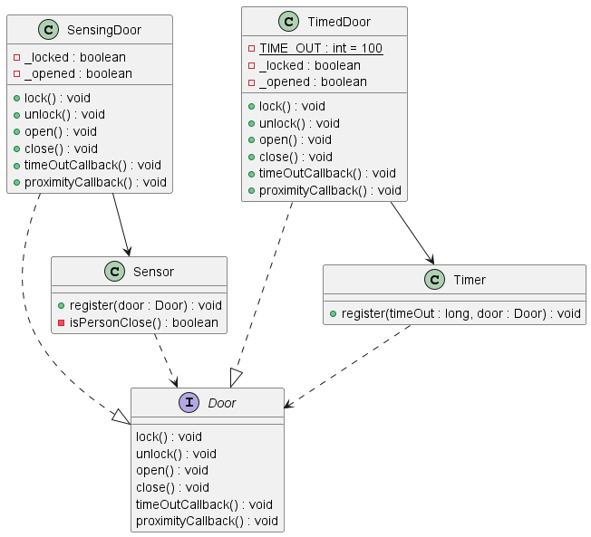
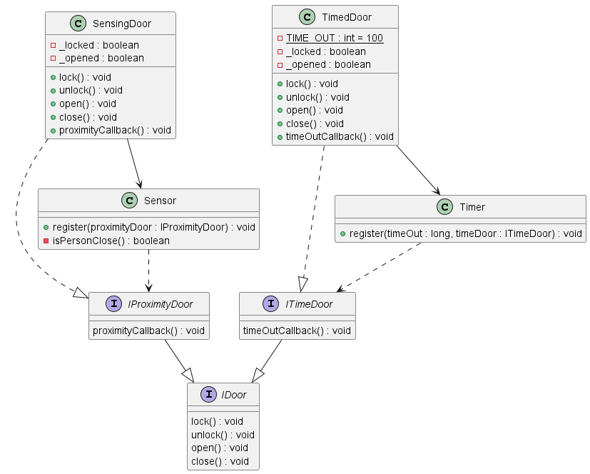
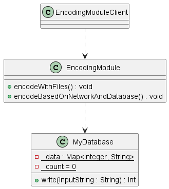
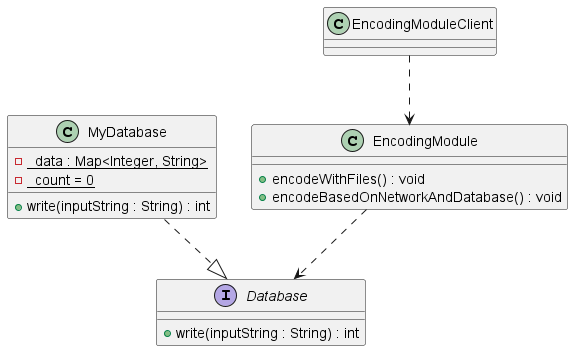

# SOLID Principles

This work was done in the first Software Architecure lab.
<!---
> **Note**
> You can find it [here](https://github.com/safa-abidi/TP1-archi-logicielles/blob/master/README.md).
--->

## SRP (Single Responsability Principle):

- __Problem:__  

      

    Each class should have one responsibility.
    The CarManager class includes data as well as 3 methods getCarNames() , getBestCar(), getCarById() which makes it vulnerable to too much modification when we want to change these methods.
    The SRP states that a class should have one and only one reason to change.
    
- __Solution:__   

       

    We have applied SRP so that the class CarDao contains the array of cars, CarRater implements the method getBestCar() and CarFormatter implements getCarsNames().

## OCP (Open Closed Principle):
- __Problem:__   

       

    ResourceAllocator contains all the logic and functionalities of Time and Space. Modifying any existing method or adding a new one (for a new resource for example) implies a change of the whole class.
    The OCP states that a class should be open for extension but closed for modification.
- __Solution:__    

       

    So we created an interface IResource and classes that implement it. Each future modification only results in changes in the corresponding class.

## LSP (Liskov Substitution Principle):
- __Problem:__   

       

    Calling quack() or swim() for electronicDuck causes exceptions.
    The LSP states that a subclass should be able to replace its superclass without any unexpected behavior.

- __Solution:__   

    

## ISP (Interface Segregation Principle):
- __Problem:__   

       

    The Door interface has 2 methods timeOutCallback() and proximityCallback(). Timer only uses the timeOutCallback() method and Sensor only uses the proximityCallback() method. 
    The ISP states that a client should not be forced to depend on methods it does not use.
- __Solution:__    

       

    We apply ISP to distinguish 2 types of Doors. Each implements the method it needs.

## DIP (Dependency Inversion Principle):
- __Problem:__   

       

    EncodingModule depends on MyDatabase. If we want to change the database, we will have to modify EncodingModule.
    The DIP states that high level classes should not depend on low level classes but on abstractions.
    
- __Solution:__   

       
    
    To remedy this, we created an interface Database that MyDatabase implements and that EncodingModule uses.
    